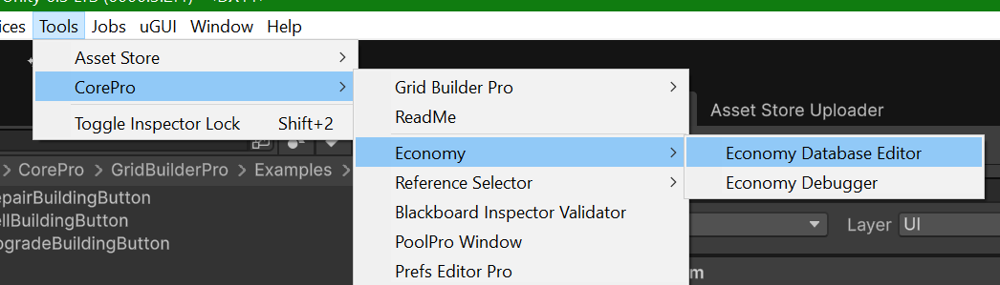

# Getting started

### Follow these simple steps to integrate the Economy System into your project.

### Step 1: Define your resources

The system relies on the Enum. You must define your custom resources directly in the code. `ResourceId`

1. Open the file: `CorePro/Economy/DataStructures/ResourceId.cs`.
2. Add your resources before the `__Count` entry.

```csharp
public enum ResourceId : int
{
    None = -1,
    Money = 0,
    Gold = 1,
    Wood = 2, 
    __Count = 3 /
}
```

***

### Step 2: Create the Resource Definition

* In the Project View, right-click and select:\
  `Create -> Core Pro -> Economy -> Resource Definition`.

<figure><figcaption></figcaption></figure>

<figure><figcaption></figcaption></figure>

***

### Step 3: Fill fields in Resource Definition

***

### Step 4: Create the Database

* In the Project View, right-click and select: `Create -> Core Pro -> Economy -> Database`.
* In the created file add Resource Definitions

<figure><figcaption></figcaption></figure>

***

### Step 6: Add Resources Definition to Database

<figure><figcaption></figcaption></figure>

### Tip: You may also use Economy Window.

<figure><figcaption></figcaption></figure>

<figure><figcaption></figcaption></figure>

***

### Step 7 : Create Economy Account:

In the Project View, right-click and select: `Create -> Core Pro -> Economy -> Economy Account`.

<figure><figcaption></figcaption></figure>

### Step 8 : Add the Manager to the Scene

1. Create an empty GameObject and name it `[Economy]`.
2. Add the component to it. `EconomyManager`
3. Assign your created **Database** asset to the `Database` field in the Inspector.
4. Assign your created **Economy** **Account** asset to the `Account` field in the Inspector.

<figure><figcaption></figcaption></figure>

