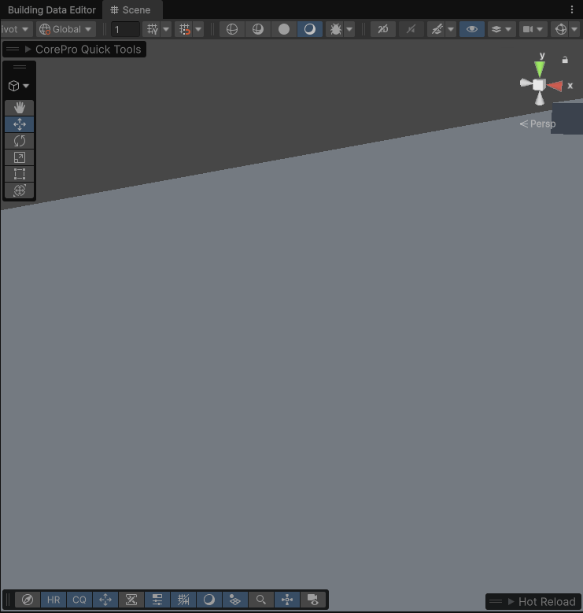

# Building Spawn Bouncer




<figure><figcaption></figcaption></figure>




<figure><figcaption></figcaption></figure>




<figure><figcaption></figcaption></figure>

Unlike standard tweening scripts, this component is designed to handle the chaotic lifecycle of game objects in Unity (pooling, mesh swapping, and unexpected activation orders). It caches the object's original scale and ensures that, regardless of how the animation is interrupted, the object returns to its intended final state.

#### Key Features

* Axis-Specific Scaling: Choose exactly which axes (X, Y, or Z) should animate.
* Initial Scale Caching: Automatically detects and respects the prefab's local scale. If your building's scale is `(0.5, 0.5, 0.5)`, it will bounce to exactly that size, not a generic `(1, 1, 1)`.
* Lazy Initialization: The script self-configures upon activation or external calls, preventing `NullReferenceExceptions`.
* Automatic Fallback: If no `Target` is assigned in the Inspector, the script automatically targets the Transform it is attached to.

| Appearance Duration | The total time (in seconds) the scale animation takes to complete.                                    |
| ------------------- | ----------------------------------------------------------------------------------------------------- |
| Pop Curve           | The Animation Curve defining the "bounce" behavior. Use values > 1 for an elastic "overshoot" effect. |
| Scale X/Y/Z         | Boolean toggles to enable/disable animation on specific axes.                                         |
| Target              | The Transform to be animated. Defaults to the current object if left empty.                           |

### Technical Behavior

1. Safety First: In `OnDisable()`, the script instantly restores the `_initialScale`. This prevents objects from being "stuck" at scale zero if the building is destroyed or pooled mid-animation.
2. Redundant Initialization: The `Init()` method is called during `Prepare()`, `OnEnable()`, and the manual `Test` button. It checks a `_isInitialized` flag to ensure setup happens exactly once, regardless of which event fires first.
3.  Relative Calculation: The final scale is calculated as:

    `CurrentScale = InitialScale * CurveValue`

    This ensures the animation is always relative to the object's original design size.

### How to Use - Basic Setup

1. Attach the `BuildingSpawnBouncer` to your building prefab or a specific mesh part.
2. Define your Pop Curve (e.g., an "Ease Out Back" for a bouncy effect).
3. If you only want the building to "grow" out of the ground, uncheck Scale X and Scale Z, leaving only Scale Y active.
