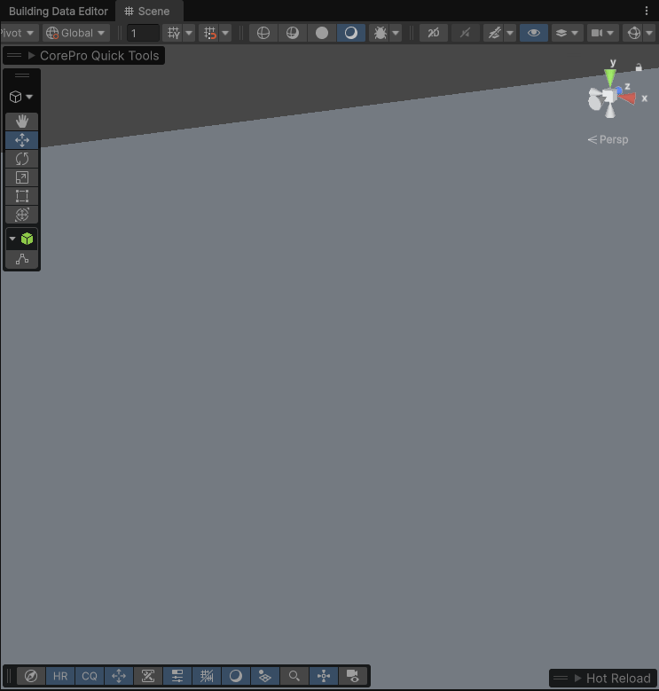
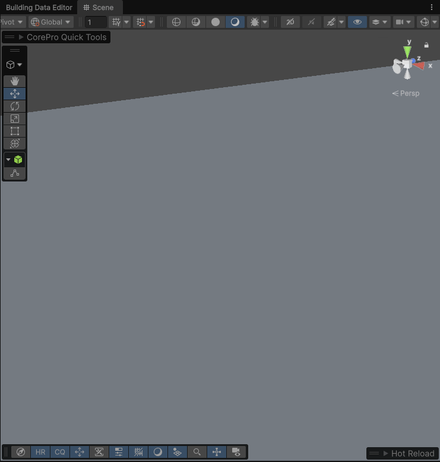

---
layout:
  width: wide
  title:
    visible: true
  description:
    visible: true
  tableOfContents:
    visible: true
  outline:
    visible: true
  pagination:
    visible: true
  metadata:
    visible: true
---

# Building Spawn Materializer



<figure><figcaption></figcaption></figure>



<figure><figcaption></figcaption></figure>




<figure><figcaption></figcaption></figure>

### Building Spawn Materializer– Technical Overview

This component manages the visual "spawn", "dissolve" or "materialise" effects of buildings by modifying shader parameters. It is engineered for high performance, ensuring smooth gameplay even when multiple buildings are constructed simultaneously.

#### 1. Understanding `MaterialPropertyBlock` (Optimization)

**This is the most critical optimization in the script.** \
Normally, when you want to change a color or a slider on a single building's material, you might use `renderer.material`.

* The Problem (Standard Approach): \
  Using `renderer.material` creates a unique copy of that material for every single object. If you have 100 buildings, Unity creates 100 material instances. This breaks Draw Call Batching, significantly increasing the load on your GPU and CPU.
* The Solution (`MaterialPropertyBlock`): \
  Think of this as a "sticky note" attached to a specific renderer. It tells the GPU: _"Use the shared building material, but for this specific object, override the `_Threshold` value to 0.5."_
  * The Benefit: All buildings continue to share the same material in memory (Batching stays intact), and you avoid memory bloat from duplicate material instances.

#### 2. Eliminating Memory Leaks with Material Caching

You may notice the script uses a `_materialCache`. \
This is to avoid a common Unity pitfall. Whenever you call `renderer.materials` (with an 's'), Unity allocates a new array and creates copies of the materials. Doing this every frame during an animation leads to massive "Garbage Collection" spikes, causing the game to stutter. Our script fetches these references once during initialization and caches them for future use.

#### 3. Animation Logic: Time vs. Progress

The script offers two distinct modes for the visual effect via `useConstructionTiming`:

1. Time - Based Mode (`useConstructionTiming: false`):\
   The effect plays over a fixed duration (e.g. 5 seconds) regardless of how long the building takes to finish. This is ideal for punchy, consistent visual feedback.
2. Progress - Based Mode (`useConstructionTiming true`): \
   The shader effect is mapped directly to the construction percentage.\
   If the building takes 10 seconds to build, the shader transition will take exactly 10 seconds.

#### 4. Key Performance Features:

* Property ID Caching: \
  Instead of searching for the string `"_Threshold"` every frame, we convert it to an integer ID once. Computers compare numbers much faster than strings.
* Animation Curves: \
  Designers can easily control the "feel" of the effect (e.g., starting fast and slowing down) using the Unity Animation Curve editor.
* Routine Management:\
  The script automatically stops previous animations before starting new ones, preventing "flickering" or conflicts when building states change rapidly.
